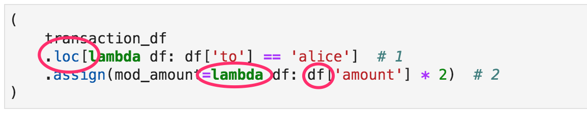

# Python For Data Science

A Python tutorial for (beginning) data scientists with a non-computer-science background.

## Introduction

Let's take a look at the following snippet of Pandas code:

If this makes you curious about:

- how `loc[]` works
- how it processes these expressions inside the square brackets
- how these mystical `lambda` expressions work
- what part of your input data is pointed to by these `df` references,

then this course is right for you! 

Instead of offering a comprehensive guided tour through the Pandas or Scikit-Learn APIs, this tutorial aims at empowering you to understand _how_ these tools work by explaining the fundamental programming constructs from which these tools are built. This will allow you to:

- effectively learn parts of the APIs that are relevant to you without supervision
- write correct code with fewer bugs by knowing what you're doing
- write readable and testable code, so your colleagues know what you're doing
- create your own tools

## Prerequisites (Audience, Skills)

To fully enjoy this tutorial, you are expected to:

- Be able to clone this repository using any git client
- Have some programming experience
- Have some conceptual understanding of basic data analysis such as filtering/selection, grouping by, aggregation, transformation

While the tutorial starts with an introduction into the most basic Python concepts, the pace will be too high for people with no coding experience whatsoever.

## Prerequisites (Technical)

To run this tutorial, you need at least:

- Any computing environment with Python >= 3.7 installed and available
- Recent Pandas (>= 1.0) and Numpy packages available globally or in a virtual environment
- Jupyter Lab (or simple Notebook) installed globally or in a virtual environment
- Any git client that allows you to clone this repository

In case of any trouble meeting these prerequisites, [this article at Real Python](https://realpython.com/effective-python-environment/) can be helpful. I suggest using a pyenv+pipenv - based environment or a conda - based environment and not creating a mix of these approaches.

Use this tutorial by cloning this repository into a directory of choice and running `jupyter lab` or `jupyter notebook` from that directory.